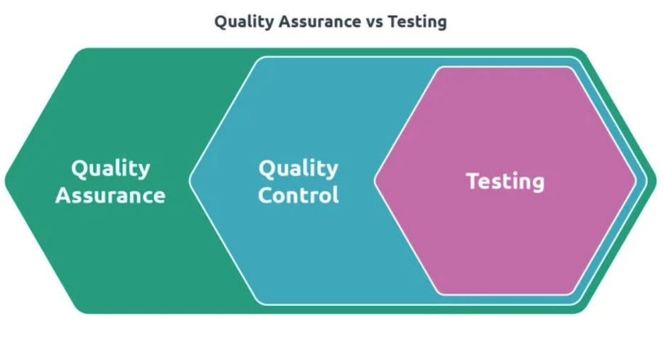

# ¿Qué es QA?

## Objetivos

- Entender la definición y la importancia de QA.
- Diferenciar entre QA, QC y pruebas.
- Conocer las metodologías de QA como Six Sigma y Total Quality Management (TQM).
- Aprender a implementar QA en diferentes etapas del ciclo de vida del software.
- Entender la implementación de QA en metodologías ágiles y tradicionales.

## Contenido

### Definición de QA

QA (Aseguramiento de la Calidad) es un proceso sistemático de verificar si un producto o servicio cumple con los requisitos especificados y las expectativas del cliente. Se centra en mejorar los procesos de desarrollo y producción para evitar defectos en los productos finales.

### Importancia de QA

- **Prevención de Defectos:** QA se enfoca en prevenir defectos en el proceso de desarrollo y producción en lugar de solo encontrarlos y corregirlos después de que ocurran.
- **Mejora Continua:** Promueve la mejora continua de los procesos y la calidad de los productos.
- **Satisfacción del Cliente:** Garantiza que los productos finales cumplan con las expectativas del cliente y los requisitos establecidos.
- **Eficiencia y Efectividad:** Aumenta la eficiencia y efectividad del proceso de desarrollo, reduciendo costos y tiempos de entrega.

### Diferencia entre QA y QC

- **QA (Aseguramiento de la Calidad):** Enfoque preventivo, orientado a procesos, centrado en la calidad desde el inicio del proceso de desarrollo hasta la entrega final del producto.
  - **Actividades de QA:**
    - Revisión de Requisitos: Asegurar que los requisitos sean claros, completos y verificables.
    - Auditorías de Calidad: Evaluar los procesos y procedimientos para garantizar su adherencia a los estándares de calidad.
    - Capacitación: Formación continua para el equipo de desarrollo sobre las mejores prácticas y estándares de calidad.

- **QC (Control de Calidad):** Enfoque reactivo, orientado a productos, centrado en identificar y corregir defectos en los productos finales.
  - **Actividades de QC:**
    - Pruebas de Software: Verificar que el software funcione según lo especificado.
    - Inspección: Revisar el producto terminado para identificar defectos.
    - Revisiones: Evaluar el producto en diferentes etapas del desarrollo para detectar y corregir errores.

#### Diagramas de Relación entre QA y QC

La imagen a continuación muestra la relación entre Aseguramiento de la Calidad (QA), Control de Calidad (QC) y Pruebas (Testing). QA es un enfoque amplio y preventivo que abarca todas las actividades de mejora de procesos y prevención de defectos. Dentro de QA, el QC es un enfoque más específico y reactivo, centrado en la identificación y corrección de defectos en los productos finales. Finalmente, las pruebas son una actividad específica dentro del QC que implica la ejecución del software para encontrar defectos.

### Pruebas vs. QC vs. QA

- **QA (Aseguramiento de la Calidad):** Proceso holístico y proactivo que se centra en mejorar el proceso de desarrollo para prevenir defectos.
- **QC (Control de Calidad):** Parte del QA que se centra en identificar y corregir defectos en los productos finales.
- **Pruebas:** Actividad específica dentro del QC que implica la ejecución del software para encontrar defectos.

### Diferencia entre Pruebas y Depuración

Las pruebas y la depuración son actividades cruciales en el proceso de desarrollo de software, pero tienen objetivos y métodos diferentes:

- **Pruebas (Testing):** Proceso de ejecución de un sistema con la intención de encontrar defectos. Incluye:
  - **Pruebas Dinámicas:** Implican la ejecución del software y observación de su comportamiento. Ejemplos: pruebas funcionales, pruebas de integración.
  - **Pruebas Estáticas:** No requieren la ejecución del software. Ejemplos: revisiones de código, análisis estático.

- **Depuración (Debugging):** Proceso de identificar, analizar y corregir los defectos encontrados durante las pruebas. Incluye:
  - **Localización de Defectos:** Identificar la causa raíz del defecto.
  - **Análisis:** Determinar por qué ocurrió el defecto.
  - **Corrección:** Modificar el código para corregir el defecto.
  - **Verificación:** Asegurarse de que el defecto haya sido corregido y no haya introducido nuevos problemas.

#### Ejemplos Prácticos y Situaciones

- **QA:** Implementación de estándares de codificación y revisión de requisitos.
- **QC:** Ejecución de pruebas automatizadas y revisiones de código.
- **Pruebas:** Pruebas unitarias, de integración y de sistema.
  