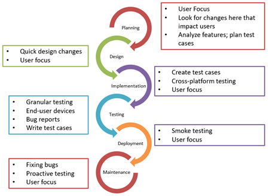

# Ciclo de Vida del Desarrollo de Software (SDLC)

## Objetivos

- Comprender las fases del SDLC.
- Entender el rol de QA en cada fase del SDLC.
- Conocer herramientas y prácticas de cada fase del SDLC.
- Aprender sobre modelos menos conocidos como el modelo espiral y DevOps.
- Entender cómo aplicar QA en metodologías modernas como DevOps.

## Contenido

### Definición del SDLC

El Ciclo de Vida del Desarrollo de Software (SDLC, por sus siglas en inglés) es un proceso estructurado que guía el desarrollo de software a través de varias fases. Proporciona una metodología organizada para la planificación, creación, prueba y despliegue de un sistema de software.

### Fases del SDLC

#### Integración en el Ciclo de Vida del Desarrollo de Software

La imagen a continuación muestra cómo se integra QA en cada fase del ciclo de vida del desarrollo de software (SDLC). Desde la planificación hasta el mantenimiento, QA juega un papel crucial en cada etapa para asegurar la calidad y la satisfacción del cliente.

1. **Planificación:**
   - **Objetivo:** Definir los objetivos y el alcance del proyecto.
   - **Actividades:** Análisis de viabilidad, definición de recursos, cronograma y presupuesto.
   - **Entregables:** Plan del proyecto, cronograma, análisis de riesgos.
   - **Rol de QA:** Asegurar que los objetivos sean claros y alcanzables, y que los requisitos de calidad se integren desde el inicio.
   - **Gestión de Riesgos:** QA puede ayudar a identificar y mitigar riesgos a través de la revisión de planes y la evaluación de posibles puntos de falla.
   - **Ejemplo Real:** En un proyecto de desarrollo de una aplicación móvil de gestión de inventarios, la planificación incluiría la estimación de recursos necesarios, la definición de hitos clave y la asignación de tareas específicas al equipo de desarrollo y QA.

2. **Análisis de Requisitos:**
   - **Objetivo:** Recopilar y analizar los requisitos del sistema.
   - **Actividades:** Entrevistas con stakeholders, documentación de requisitos, análisis de viabilidad.
   - **Entregables:** Documentos de requisitos, especificaciones funcionales.
   - **Rol de QA:** Verificar que los requisitos sean completos, claros y verificables, y que contemplen criterios de calidad.
   - **Técnicas:** Entrevistas, talleres de requisitos, análisis de casos de uso.
   - **Ejemplo Real:** Para la aplicación móvil de gestión de inventarios, el análisis de requisitos podría incluir reuniones con los interesados para definir funcionalidades como el seguimiento de inventarios, alertas de stock bajo y generación de informes.

3. **Diseño:**
   - **Objetivo:** Crear la arquitectura y el diseño del sistema.
   - **Actividades:** Diseño de la arquitectura del sistema, diagramas de flujo, diseño de la interfaz de usuario.
   - **Entregables:** Diagramas UML, especificaciones de diseño.
   - **Rol de QA:** Revisar y validar los diseños para asegurar que cumplen con los requisitos y estándares de calidad.
   - **Ejemplos de Artefactos:** Diagramas de clases, diagramas de secuencia.
   - **Ejemplo Real:** En el diseño de la aplicación móvil de gestión de inventarios, se podrían crear diagramas UML para representar las interacciones entre los módulos de seguimiento de inventarios, alertas y generación de informes.

4. **Desarrollo:**
   - **Objetivo:** Codificación y construcción del sistema.
   - **Actividades:** Programación, integración de sistemas, desarrollo de bases de datos.
   - **Entregables:** Código fuente, módulos integrados.
   - **Rol de QA:** Asegurar la adherencia a los estándares de codificación y realizar revisiones de código.
   - **Prácticas Ágiles:** TDD (Test-Driven Development), BDD (Behavior-Driven Development).
   - **Ejemplo Real:** Durante el desarrollo de la aplicación móvil de gestión de inventarios, los desarrolladores escriben código para las funcionalidades de seguimiento de inventarios y generación de informes, mientras QA realiza revisiones de código y pruebas unitarias.

5. **Pruebas:**
   - **Objetivo:** Verificación y validación del sistema.
   - **Actividades:** Pruebas unitarias, pruebas de integración, pruebas de sistema, pruebas de aceptación.
   - **Entregables:** Informes de pruebas, casos de prueba, resultados de pruebas.
   - **Rol de QA:** Planificar, diseñar, ejecutar y reportar las pruebas para asegurar que el sistema cumple con los requisitos y expectativas.
   - **Frameworks de Pruebas:** JUnit, pytest.
   - **Planes de Pruebas:** Crear y gestionar casos de prueba detallados y asegurar su completa ejecución.
   - **Ejemplo Real:** En la aplicación móvil de gestión de inventarios, QA realizaría pruebas de integración para verificar la interacción entre los módulos de seguimiento de inventarios, alertas y generación de informes.

6. **Implementación:**
   - **Objetivo:** Despliegue del sistema en el entorno de producción.
   - **Actividades:** Instalación del sistema, migración de datos, capacitación de usuarios.
   - **Entregables:** Sistema desplegado, usuarios capacitados.
   - **Rol de QA:** Validar el despliegue y realizar pruebas post-implementación para asegurar una transición suave.
   - **Prácticas de Despliegue:** Despliegue continuo, DevOps.
   - **Ejemplo Real:** Para una nueva funcionalidad en la aplicación móvil de gestión de inventarios, QA validaría el despliegue en el entorno de producción y capacitaría a los usuarios en el uso de la nueva funcionalidad.

7. **Mantenimiento:**
   - **Objetivo:** Realización de cambios y mejoras en el sistema.
   - **Actividades:** Corrección de errores, actualizaciones de software, mejoras de funcionalidad.
   - **Entregables:** Actualizaciones, parches, mejoras.
   - **Rol de QA:** Asegurar que los cambios no introduzcan nuevos defectos y que el sistema continúe cumpliendo con los estándares de calidad.
   - **Gestión de Cambios:** Controlar y documentar todos los cambios en el sistema.
   - **Automatización de Pruebas de Regresión:** Asegurar que las nuevas versiones no afecten negativamente las funcionalidades existentes.
   - **Ejemplo Real:** Durante el mantenimiento de la aplicación móvil de gestión de inventarios, QA realizaría pruebas de regresión para asegurar que las actualizaciones del sistema no afecten las funcionalidades existentes, como el seguimiento de inventarios y la generación de informes.

### Modelos del SDLC

Existen varios modelos de SDLC, cada uno con sus propias características y enfoques:

- **Modelo en Cascada:** Proceso secuencial donde cada fase debe completarse antes de que comience la siguiente.
- **Modelo Ágil:** Enfoque flexible y adaptable que promueve entregas incrementales y la colaboración constante con los stakeholders.

### Importancia de QA en el SDLC

QA juega un papel crucial en cada fase del SDLC para asegurar que se cumplan los estándares de calidad y que el producto final cumpla con las expectativas del cliente. QA no es solo responsabilidad del equipo de pruebas, sino que debe integrarse en todo el proceso de desarrollo.

